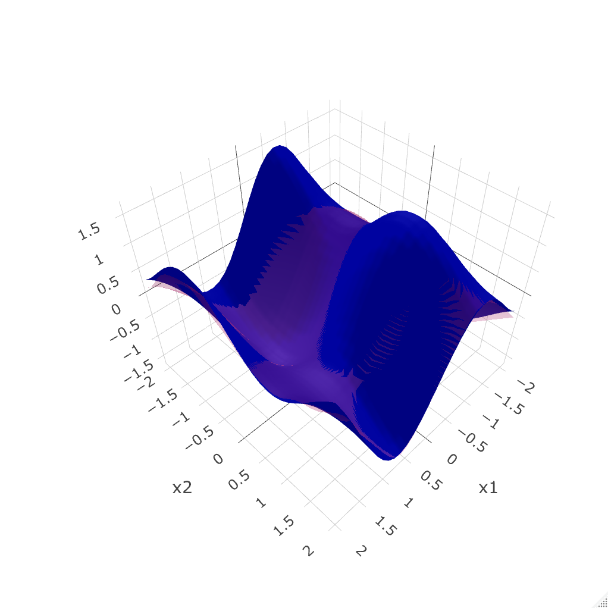
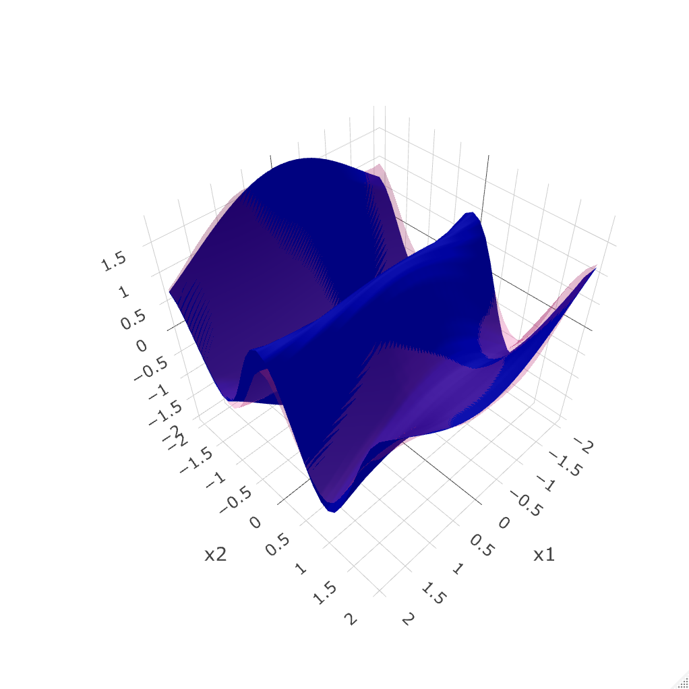

# Shapley Curves: A Smoothing Perspective

This repository contains the implementation code for the paper ["Shapley Curves: A Smoothing Perspective"](https://www.tandfonline.com/doi/full/10.1080/07350015.2024.2365781), published in the Journal of Business and Economic Statistics.

## Abstract

This article fills the limited statistical understanding of Shapley values as a variable importance measure from a nonparametric (or smoothing) perspective. We introduce population-level Shapley curves to measure the true variable importance, determined by the conditional expectation function and the distribution of covariates. Having defined the estimand, we derive minimax convergence rates and asymptotic normality under general conditions for the two leading estimation strategies. For finite sample inference, we propose a novel version of the wild bootstrap procedure tailored for capturing lower-order terms in the estimation of Shapley curves. Numerical studies confirm our theoretical findings, and an empirical application analyzes the determining factors of vehicle prices.


### Shapley Curves

<div align="center">

| Component 1 | Component 2 |
|-------------|-------------|
|  |  |

</div>

*Comparison of estimation methods for the first two components of the Shapley decomposition: Blue curves represent component-based estimation, red curves represent integration-based estimation.*


## Usage


### Python Version  
```python
import numpy as np
import pandas as pd
import sys
sys.path.append('./python')
from src.algorithms import ShapleyEstimator

# Generate sample data
np.random.seed(42)
X = pd.DataFrame({
    'X1': np.random.normal(0, 1, 100),
    'X2': np.random.normal(0, 1, 100), 
    'X3': np.random.normal(0, 1, 100)
})
y = -np.sin(2*X['X1']) + 0.5*X['X2']**2 + 0.3*X['X3'] + 0.1*np.random.normal(0, 1, 100)

# Create and fit Shapley estimator
estimator = ShapleyEstimator(
    kernel='gau',        # Gaussian kernel
    bandwidth='cv_ls',   # Cross-validation bandwidth selection
    reg_type='ll'        # Local linear regression
)
estimator.fit(X, y)

# Define evaluation points for Shapley curves
evaluation_points = {}
for col in X.columns:
    evaluation_points[col] = np.linspace(X[col].quantile(0.1), X[col].quantile(0.9), 20)

# Estimate Shapley curves for all variables
shapley_curves = estimator.estimate_all_curves(evaluation_points)

# Display results
for variable, curve in shapley_curves.items():
    print(f"Shapley curve for {variable}: range [{np.min(curve):.3f}, {np.max(curve):.3f}]")
```

## Note
The original code of the paper has been written in R. For experimental reasons, I have translated the R code to Python using Cursor and the model Claude-4-Sonnet (thinking). It took around 6 hours of iteration, and is still, in my opinion, not perfectly aligned with the original R version.

## Contact

**Ratmir Miftachov**: contact[at]miftachov.com  
**Georg Keilbar**: keilbar[at]hu-berlin.de  
**Wolfgang Karl Härdle**: haerdle[at]hu-berlin.de 